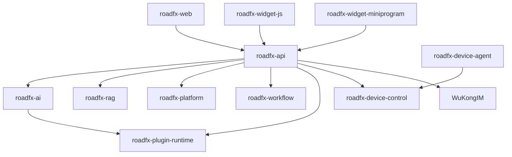

# ROADFX Workspace — AGENTS.md

> 最近校准: 2026-03-11

## Policies & Mandatory Skills

### `$local-services`

Before any runtime verification or manual testing, ensure local services are running. Use `$local-services` to start the minimum set (infrastructure + roadfx-api + roadfx-ai) or check current status.

Run it when:
- You need to run `$functional-verification` but services are not up
- Starting a new development session that involves backend changes

Skip when:
- Only making docs, config, or frontend-only changes that don't need a running server
- Services are already confirmed running via `$local-services` status check

### `$implementation-strategy`

Before modifying runtime, API, or cross-service code, use `$implementation-strategy` to analyze change impact — it maps files to service ownership, outputs the dependency graph, and lists sync points.

Run it when:
- Changes touch `repos/*/app/api/`, `repos/*/app/services/`, `repos/*/app/runtime/`, or `repos/*/app/schemas/`
- Changes span 2+ services
- You're unsure which upstream/downstream services are affected

Skip when:
- Single-service, single-file changes with obvious scope (e.g., fixing a typo in one component)

### `$code-change-verification`

Run `$code-change-verification` before marking work complete when changes affect runtime code, build, or tests. This runs lint, type-check, and build per service.

Run it when:
- Changes touch any code in `repos/*/`

Skip when:
- Changes are docs-only (`AGENTS.md`, `README.md`, `.skills/`)
- Changes are config-only (`.env*`, `docker-compose*`, `Makefile`) with no code impact

### `$db-migration-check`

Use `$db-migration-check` to verify that model changes have corresponding Alembic migrations.

Run it when:
- Changes touch `models/*.py` or `models/**/*.py` in any service

Skip when:
- No model files were modified

### `$cross-service-sync`

Use `$cross-service-sync` to detect schema/type changes that may need synchronized updates in other services.

Run it when:
- Changes touch files under `schemas/`, `types/`, or API response structures
- Changes modify Pydantic models that are consumed by other services

Skip when:
- Schema changes are internal to a single service with no external consumers

### `$streaming-protocol-check`

Use `$streaming-protocol-check` to verify streaming protocol consistency across producer (roadfx-ai), relay (roadfx-api), and consumers (roadfx-web, roadfx-widget-js, roadfx-widget-miniprogram).

Run it when:
- Changes touch `streaming/`, `wukongim`, SSE, `stream.delta`, `MixedStreamParser`, or `json-render` code

Skip when:
- Changes don't involve any streaming or real-time messaging paths

### `$functional-verification`

Use `$functional-verification` alongside `$code-change-verification` to validate API changes at runtime using roadfx-cli (staff) and roadfx-widget-cli (visitor). This goes beyond static checks — it makes real API calls.

Run it when:
- Changes affect backend API endpoints, service logic, chat flow, agent config, knowledge/RAG, workflow, or platform integration
- Local services are running (use `$local-services` first if not)

Skip when:
- Changes are frontend-only or static-check is sufficient
- Local services are not available and cannot be started

### `$pr-draft-summary`

Use `$pr-draft-summary` when reporting code changes as complete — it generates a change summary grouped by service with commit history and diff stats.

Run it when:
- Work is finished and ready to commit or create a pull request

Skip when:
- Trivial or conversation-only tasks where no PR summary is expected

## Development Workflow

1. Read the target service's `AGENTS.md` before making changes.
2. If changes span multiple services or touch APIs, run `$implementation-strategy` to understand impact.
3. If local services are needed, run `$local-services` to start the minimum set.
4. Make changes — follow the target service's Rules and Constraints.
5. If model files changed, run `$db-migration-check`.
6. If schema/type files changed, run `$cross-service-sync`.
7. If streaming code changed, run `$streaming-protocol-check`.
8. Run `$code-change-verification` to validate lint/type-check/build.
9. If backend logic changed and services are running, run `$functional-verification` alongside `$code-change-verification`.
10. When work is complete, run `$pr-draft-summary` to generate the PR summary.

## Architecture



## Services

| Service | Dir | Role | Port |
|:--------|:----|:-----|:-----|
| roadfx-api | `repos/roadfx-api` | Core API gateway, multi-tenant | 8000 |
| roadfx-ai | `repos/roadfx-ai` | LLM, Agent runtime | 8081 |
| roadfx-rag | `repos/roadfx-rag` | Knowledge base, RAG | 18082 |
| roadfx-platform | `repos/roadfx-platform` | Channel message sync | 8003 |
| roadfx-workflow | `repos/roadfx-workflow` | Workflow engine | 8004 |
| roadfx-plugin-runtime | `repos/roadfx-plugin-runtime` | Plugin & MCP runtime | 8090 |
| roadfx-device-control | `repos/roadfx-device-control` | Device management | 8085 |
| roadfx-device-agent | `repos/roadfx-device-agent` | Device-side Go agent | N/A |
| roadfx-web | `repos/roadfx-web` | Admin frontend | 5173 |
| roadfx-widget-js | `repos/roadfx-widget-js` | Visitor chat widget | 5174 |
| roadfx-widget-miniprogram | `repos/roadfx-widget-miniprogram` | WeChat mini-program widget | N/A |
| roadfx-cli | `repos/roadfx-cli` | Staff CLI + MCP server | N/A |
| roadfx-widget-cli | `repos/roadfx-widget-cli` | Visitor CLI + MCP server | N/A |

Infra: PostgreSQL + pgvector, Redis, WuKongIM, Celery (RAG/Workflow workers)

## Constraints

- No bare `dict` (Python) or `any` (TypeScript) in business interfaces
- No cross-service direct DB access — use HTTP clients in `services/`
- No hardcoded URLs, secrets, or environment addresses — use `.env` + config
- Model/table changes must include Alembic migration
- Migration and code must be committed together

## Tech Stack

- Backend: Python 3.11, FastAPI, SQLAlchemy 2, Alembic, Pydantic v2
- Frontend: roadfx-web (React 19 + TS + Vite 7 + Zustand), roadfx-widget-js (React 18 + TS + Vite 5)
- Device: Go 1.22 (roadfx-device-agent)
- Mini-program: Pure JS (ES5), WeChat native components

## Quick Start

```bash
cp .env.dev.example .env.dev
make dev
```

Optional dev helpers:

```bash
make dev PROFILES=monitoring
make dev DISABLE=roadfx-rag-beat,roadfx-workflow-worker
```

## Service AGENTS.md Entry Points

- [`repos/roadfx-ai/AGENTS.md`](repos/roadfx-ai/AGENTS.md)
- [`repos/roadfx-api/AGENTS.md`](repos/roadfx-api/AGENTS.md)
- [`repos/roadfx-web/AGENTS.md`](repos/roadfx-web/AGENTS.md)
- [`repos/roadfx-rag/AGENTS.md`](repos/roadfx-rag/AGENTS.md)
- [`repos/roadfx-platform/AGENTS.md`](repos/roadfx-platform/AGENTS.md)
- [`repos/roadfx-workflow/AGENTS.md`](repos/roadfx-workflow/AGENTS.md)
- [`repos/roadfx-plugin-runtime/AGENTS.md`](repos/roadfx-plugin-runtime/AGENTS.md)
- [`repos/roadfx-device-control/AGENTS.md`](repos/roadfx-device-control/AGENTS.md)
- [`repos/roadfx-device-agent/AGENTS.md`](repos/roadfx-device-agent/AGENTS.md)
- [`repos/roadfx-widget-js/AGENTS.md`](repos/roadfx-widget-js/AGENTS.md)
- [`repos/roadfx-widget-miniprogram/AGENTS.md`](repos/roadfx-widget-miniprogram/AGENTS.md)
- [`repos/roadfx-cli/AGENTS.md`](repos/roadfx-cli/AGENTS.md)
- [`repos/roadfx-widget-cli/AGENTS.md`](repos/roadfx-widget-cli/AGENTS.md)
