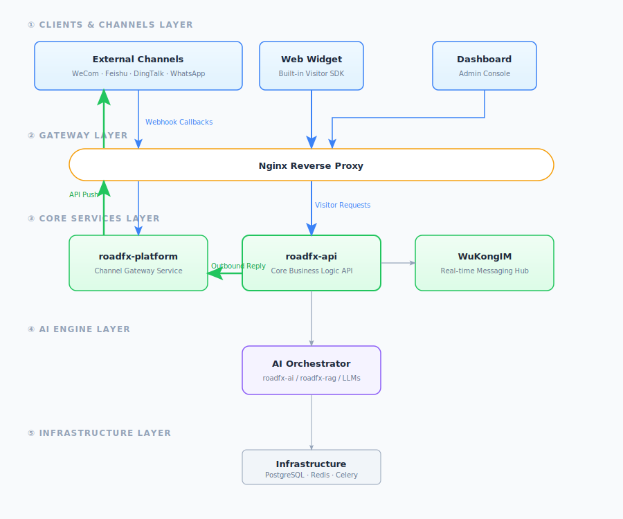
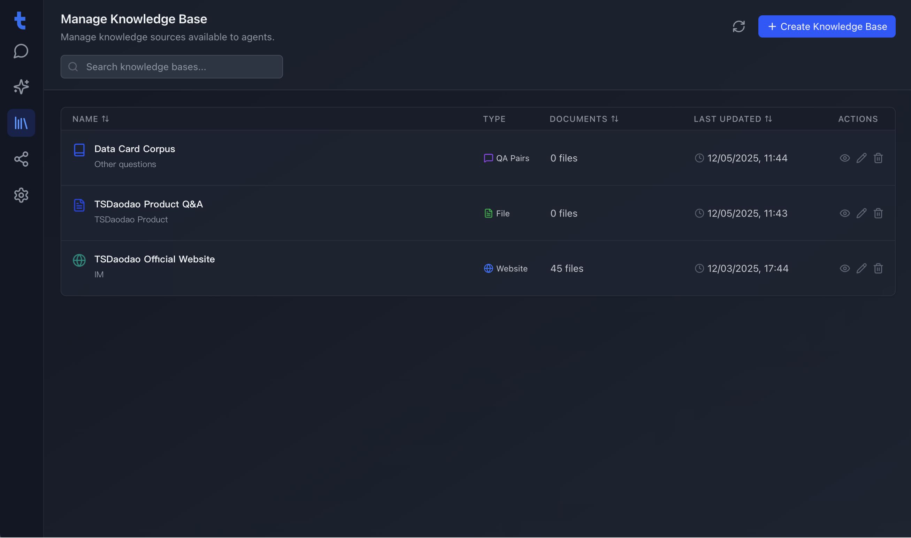
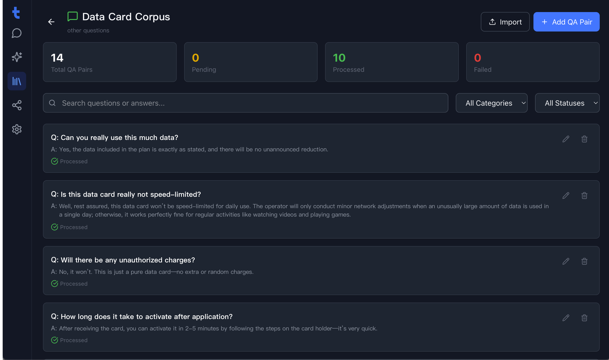
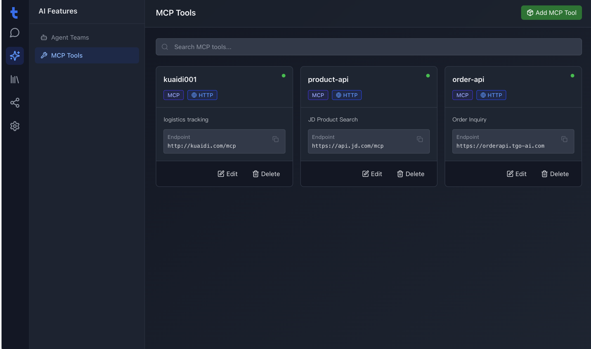
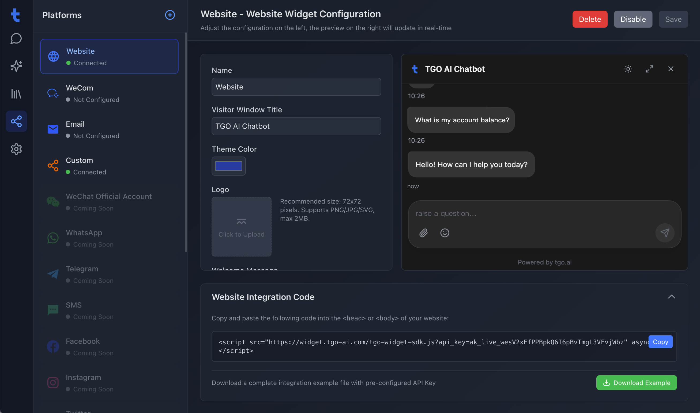

<p align="center">
  
</p>

<p align="center">
  <a href="./README.md">English</a> | <a href="./README_CN.md">简体中文</a> | <a href="./README_TC.md">繁體中文</a> | <a href="./README_JP.md">日本語</a> | <a href="./README_RU.md">Русский</a>
</p>

<p align="center">
  <a href="https://roadfx.ai">Веб-сайт</a> | <a href="https://roadfx.ai">Документация</a>
</p>

## Введение в ROADFX

ROADFX — это платформа с открытым исходным кодом для создания ИИ-агентов поддержки клиентов, призванная помочь предприятиям «Создавать команды ИИ-агентов для обслуживания клиентов». Она объединяет многоканальный доступ, оркестрацию агентов, управление базой знаний (RAG) и совместную работу с операторами.


## 🚀 Быстрый старт (Quick Start)

### Развертывание в один клик

Выполните следующую команду на вашем сервере, чтобы проверить требования, клонировать репозиторий и запустить сервисы:

```bash
REF=latest curl -fsSL https://raw.githubusercontent.com/ivansslo/roadfx/main/bootstrap.sh | bash
```

---

Для получения дополнительной информации посетите [Документацию](https://roadfx.ai).

## ✨ Основные возможности

### 🤖 Оркестрация ИИ-агентов
- **Поддержка нескольких агентов** - Настройка нескольких ИИ-агентов для разных бизнес-сценариев
- **Интеграция с разными моделями** - Подключение к различным LLM-провайдерам (OpenAI, Anthropic и др.)
- **Потоковая передача** - Ответы ИИ в реальном времени через SSE для плавного общения
- **Контекстная память** - Сохранение истории разговора для связного диалога

### 📚 Управление базой знаний (RAG)
- **База документов** - Загрузка документов для повышения точности ответов ИИ
- **База вопросов и ответов** - Создание пар Q&A для быстрого расширения знаний
- **База веб-сайтов** - Сканирование веб-сайтов для актуальной информации
- **Умный поиск** - Векторный семантический поиск для точных ответов

### 🔧 Интеграция MCP-инструментов
- **Магазин инструментов** - Богатая библиотека MCP-инструментов с включением по требованию
- **Пользовательские инструменты** - Настройка и управление инструментами на уровне проекта
- **OpenAPI Schema** - Автоматический парсинг схем для создания интерактивных форм

### 🌐 Многоканальный доступ
- **Веб-виджет** - Встраиваемый чат-виджет для веб-сайтов
- **Интеграция с WeChat** - Поддержка официальных аккаунтов и мини-программ
- **Единое управление** - Управление всеми каналами из одной панели

### 💬 Коммуникация в реальном времени
- **Интеграция WuKongIM** - Стабильный и надёжный обмен сообщениями
- **WebSocket-соединение** - Эффективная двусторонняя связь
- **Синхронизация сообщений** - Статус прочтения, подтверждение доставки
- **Мультимедиа** - Поддержка текста, изображений, файлов и многого другого

### 👥 Совместная работа человека и ИИ
- **Умная передача** - Бесшовная передача оператору при необходимости
- **Управление посетителями** - Сбор информации, назначение сессий, история
- **Рабочее пространство оператора** - Единый интерфейс для операторов

### 🎨 Система UI-виджетов
- **Структурированное отображение** - Заказы, товары, логистика в красивых карточках
- **Богатые компоненты** - Карточки заказов, отслеживание доставки, товары, сравнение цен
- **Протокол действий** - Стандартизированный URI-протокол для взаимодействий

## 📦 Структура репозиториев

| Репозиторий | Описание | Технологии |
|:---|:---|:---|
| [roadfx-ai](repos/roadfx-ai) | Сервис AI/ML-операций: управление агентами, привязка инструментов, базы знаний и аналитика использования | Python / FastAPI |
| [roadfx-api](repos/roadfx-api) | Основной бизнес-сервис: управление пользователями, отслеживание посетителей, назначение сессий и коммуникации | Python / FastAPI |
| [roadfx-cli](repos/roadfx-cli) | CLI-инструмент и MCP-сервер, позволяющий ИИ-агентам выполнять операции поддержки с 40+ встроенными инструментами | TypeScript / Node.js |
| [roadfx-device-agent](repos/roadfx-device-agent) | Встроенный агент на управляемых устройствах, предоставляющий файловые и shell-возможности через TCP JSON-RPC | Go |
| [roadfx-device-control](repos/roadfx-device-control) | Сервис управления устройствами через TCP/JSON-RPC с встроенным MCP Agent | Python / FastAPI |
| [roadfx-platform](repos/roadfx-platform) | Многоканальный сервис приёма сообщений: WeChat, Feishu, DingTalk, Telegram, Slack, email и др. | Python / FastAPI |
| [roadfx-plugin-runtime](repos/roadfx-plugin-runtime) | Сервис управления жизненным циклом плагинов с динамической синхронизацией инструментов | Python / FastAPI |
| [roadfx-rag](repos/roadfx-rag) | RAG-сервис: обработка документов, гибридный семантический/полнотекстовый поиск и асинхронная обработка | Python / FastAPI |
| [roadfx-web](repos/roadfx-web) | Административный фронтенд: чат в реальном времени, управление агентами, база знаний и MCP-инструменты | TypeScript / React 19 |
| [roadfx-workflow](repos/roadfx-workflow) | Движок выполнения рабочих процессов AI Agent с поддержкой DAG-топологии, узлов LLM, API, условий и инструментов | Python / FastAPI |

### Widget SDK

| Репозиторий | Описание | Технологии |
|:---|:---|:---|
| [roadfx-widget-js](repos/roadfx-widget-js) | Встраиваемый чат-виджет поддержки клиентов для веб-сайтов (в стиле Intercom) | TypeScript / React 18 |
| [roadfx-widget-ios](repos/roadfx-widget-ios) | Нативный iOS SDK чата поддержки клиентов с SwiftUI и UIKit-мостом | Swift / SwiftUI |
| [roadfx-widget-flutter](repos/roadfx-widget-flutter) | Кроссплатформенный виджет чата поддержки для iOS и Android | Dart / Flutter |
| [roadfx-widget-cli](repos/roadfx-widget-cli) | CLI-инструмент и MCP-сервер для посетителей, предоставляющий интерфейс поддержки | TypeScript / Node.js |
| [roadfx-widget-miniprogram](repos/roadfx-widget-miniprogram) | Компонент чата для мини-программ WeChat с потоковыми ответами ИИ и рендерингом Markdown | TypeScript |

## 🏗️ Архитектура системы

<p align="center">
  
</p>

## Обзор продукта

| | |
|:---:|:---:|
| **Дашборд** <br>  | **Оркестрация агентов** <br>  |
| **База знаний** <br>  | **Отладка Q&A** <br>  |
| **Инструменты MCP** <br>  | **Администрирование** <br>  |

## Системные требования
- **CPU**: >= 4 Core
- **RAM**: >= 8 GiB
- **OS**: macOS / Linux / WSL2
